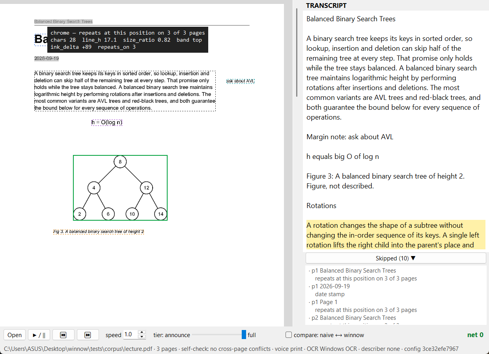

# Winnow

**A read-aloud tool that knows what is worth reading.**

Winnow reads PDFs, scans and photos of pages aloud, entirely on your own machine. Unlike
ordinary read-aloud, it decides what each part of a page *is* before speaking it:

- **Skips page furniture**: running headers, page numbers, watermarks such as "Scanned
  by CamScanner", date stamps, and stamps printed sideways in the margin. Every skip is
  listed with its reason, so nothing disappears without a trace.
- **Describes figures** with a local vision model instead of reading out tick labels,
  using the caption as context. When the model cannot read a figure it says so, rather
  than inventing a description.
- **Reads tables row by row**, naming each value by its column header.
- **Speaks equations as words**: "x squared plus y squared equals r squared", not
  "x 2 plus y 2 equals r 2".
- **Announces margin notes** between paragraphs, never in the middle of a sentence.
- **Stays offline.** Every run happens under a network guard, and the window shows its
  counter: `net 0`.

## The difference, on one page

The same page of `tests/corpus/lecture.pdf`, read two ways.

**Ordinary read-aloud** (the text layer, top to bottom):

> Balanced Binary Search Trees Balanced Binary Search Trees 2026-09-19 A binary search
> tree keeps its keys in sorted order, so lookup, insertion and deletion can skip half of
> the remaining tree at every step. That promise only **ask about AVL** holds while the tree
> stays balanced. […] h = O(log n) **8 4 12 2 6 10 14** Fig 3. A balanced binary search
> tree of height 2 **Page 1**

**Winnow:**

> Balanced Binary Search Trees
> A binary search tree keeps its keys in sorted order, so lookup, insertion and deletion
> can skip half of the remaining tree at every step. That promise only holds while the
> tree stays balanced. […]
> Margin note: ask about AVL
> h equals big O of log n
> Figure 3: The figure is a binary tree diagram showing a balanced binary search tree with
> a height of 2. The root node is 8, which has two children: 4 and 12. […]
>
> *Skipped: "Balanced Binary Search Trees" — repeats at this position on 3 of 3 pages ·
> "2026-09-19" — date stamp · "Page 1" — repeats at this position on 3 of 3 pages*

The ordinary reader says the tree's node labels, "8 4 12 2 6 10 14", and moves on.
Winnow describes the figure itself. Try it:
`python -m winnow compare tests/corpus/lecture.pdf --describer llamacpp`.

## The window



Drag a document onto the window. Furniture is greyed out on the page, and the part being
spoken is outlined and scrolled into view. Hover any region to see the rule that
classified it and the numbers behind it (`chrome — repeats at this position on 3 of 3
pages · size_ratio 0.82 · band top`). **Skipped (n)** lists every skip with its reason.
The tier slider moves between *announce* ("Heading. Paragraph. Figure 3."), *summarise*
and *full*, without re-analysing the document. **Compare** plays the ordinary reading
of the same file.

Reading starts as soon as the page is analysed. Figures are described in the background
while the text is read, and reading only waits if it reaches a figure whose description
is not ready yet.

## Getting started

Windows 10 or 11; developed and tested with Python 3.14.

```
pip install -r requirements.txt
python -m winnow fetch-models                   # once: EasyOCR weights (~100 MB)
python -m winnow ui tests/corpus/lecture.pdf    # the window
```

Without EasyOCR's weights, scans fall back to Windows' built-in OCR.

### Figure descriptions (optional)

Figures are described by [Qwen3-VL-2B](https://huggingface.co/Qwen/Qwen3-VL-2B-Instruct-GGUF)
served locally by [llama.cpp](https://github.com/ggml-org/llama.cpp). Download
`Qwen3VL-2B-Instruct-Q4_K_M.gguf` and `mmproj-Qwen3VL-2B-Instruct-Q8_0.gguf` (1.55 GB
together) and llama.cpp's **Vulkan** build, then:

```
llama-server -m Qwen3VL-2B-Instruct-Q4_K_M.gguf --mmproj mmproj-Qwen3VL-2B-Instruct-Q8_0.gguf --host 127.0.0.1 --port 8080 -c 4096 -ngl 0
python -m winnow ui DOC.pdf --describer llamacpp
```

`-ngl 0` runs the image encoder on the integrated GPU and the language model on the
CPU, which was the fastest split on an Intel laptop (see Speed). The server listens on
loopback only, so the offline guard still holds. Ollama works too:
`--describer ollama:qwen3-vl:2b` after `ollama pull qwen3-vl:2b`. Without a model,
figures fall back audibly to their caption.

### Command line

```
python -m winnow read DOC                  # transcript; --speak to hear it, --tier 0|1|2
python -m winnow compare DOC               # ordinary read-aloud vs Winnow
python -m winnow render DOC out/           # every page with its regions drawn and labelled
python -m winnow read DOC --no-repair --json   # raw output, exactly reproducible
python -m pytest tests                     # 110 tests
```

`DOC` is a PDF or an image (PNG, JPG, TIFF). A PDF with a text layer is read directly;
anything else goes through OCR.

## Speed

Measured on a laptop with an Intel i5-12500H, Iris Xe graphics and 16 GB of memory:

| | time |
| --- | --- |
| PDF with a text layer, ready to speak | 0.5 s |
| Scanned page, ready to speak | 2 s |
| One figure description (image on the GPU, text on the CPU) | 3.9–4.7 s, in the background |
| A 17 × 103 inch page of notes (13,445 px tall) | 89 s |

On a **Snapdragon X Elite NPU** (measured through Qualcomm AI Hub), the OCR recogniser
takes 19 ms per line with every layer on the NPU and gives identical text, against
140 ms on the laptop CPU. The details, and every other number, are in
[docs/measurements.md](docs/measurements.md).

## How it works

```
PDF text layer ─┐                                   ┌─ figures ─> vision model ─┐
                ├─> regions ─> measure ─> classify ─┤                           ├─> plan ─> speech
scan ─> segment ┘   (boxes)    (line      (+ whole- └─> check ─> order ─> bind ─┘  (pure)
         + OCR                  height,    document
                                ink)       memory)
```

1. **Regions.** A PDF's text layer gives words and graphics directly; figures, tables,
   columns and sideways text are found from their geometry. Scans are segmented into
   blocks and read with OCR on Winnow's own line boxes.
2. **Classify.** Each region becomes furniture, heading, body, caption, figure, table,
   equation or margin note. Furniture rules run in priority order, and the strongest
   is document memory: text that repeats at the same position on several pages.
3. **Check.** The document checks itself. The same text classified differently on
   different pages is a contradiction; it is repaired only with a clear majority over
   at least three pages, and otherwise reported and left alone.
4. **Order and bind.** Columns are read in order, margin notes are placed between
   paragraphs, and each caption is bound to its figure or table.
5. **Plan.** A pure planner turns regions into what is said, at three depths. Nothing is
   dropped: skipped regions keep their reasons.

The rules behind these decisions, and the failure modes they guard against, are in
[docs/design.md](docs/design.md).

| module | does |
| --- | --- |
| `types.py` | `Region`, `Utterance`, and `Config`: every threshold in one place |
| `pdf_adapter.py`, `pdf_figures.py` | text layer → regions; figures, captions, tables, columns |
| `segment.py`, `lines.py`, `ocr.py` | scans: page preparation, blocks, lines, OCR |
| `chrome.py`, `classify.py` | furniture rules, then every other kind, with evidence |
| `reading_order.py`, `caption_binding.py` | columns, margin notes, caption → figure |
| `describe.py` | figure descriptions and their fallbacks |
| `tables.py`, `speech.py` | pure: table reading, and the speech plan |
| `selfcheck.py` | per-page checks, cross-page reconciliation and repair |
| `pipeline.py` | orchestration; parallel page analysis, background describing |
| `backends.py`, `ocr_backends.py` | voice, OCR engines and vision models, passed in |
| `ui.py`, `ui_page.py`, `label_ui.py` | the window, the page view, the labelling window |
| `evaluate.py` | benchmark scoring and threshold tuning |

## Accuracy and testing

Every bug found on a real document became a test: 110 tests, which run without audio, a
model or a device because the speech planner is pure. On the bundled test documents
Winnow scores content precision 1.000, furniture recall 1.000 and 50/50 correct kinds.
One person checked those labels, so treat that as a regression check, not a benchmark.

It has also been run on four arXiv papers (ResNet, Adam, Batch Normalization,
Transformer) and a long page of dark-mode notes. On the papers it found all 23 charts
and diagrams with no table mistaken for one, and read 21 captioned tables. On an
excerpt of the notes, OCR read 66 of 69 words correctly.

An independent benchmark (about 100 pages, two labellers) is the next step. The tools
for it are included: a holdout planner, a labelling window, scoring and a gated
threshold tuner ([docs/benchmark.md](docs/benchmark.md)).

## Limitations

- Tables are read only from a PDF's text layer, and only when captioned. Tables in scans
  are read as plain text, and columns closer than 16 px merge.
- OCR loses superscripts on scans (`x² + y² = r²` reads "x2 + Y2") and misreads some
  handwriting-style fonts. Very long pages take over a minute on a laptop CPU.
- A symbol a PDF's font does not map to Unicode comes out as "�".
- Figure descriptions come from a 2-billion-parameter model: good on simple charts and
  diagrams, and not always identical between runs.
- Windows only: speech uses Windows' built-in voices, and OCR falls back to Windows OCR.

What comes next is in [docs/roadmap.md](docs/roadmap.md).

## License

MIT. See [LICENSE](LICENSE).
